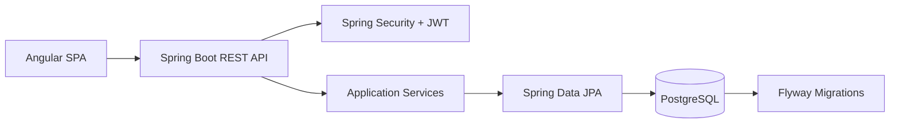

# ReserveHub

[](https://github.com/AlcaLock/reservation_system/actions/workflows/ci-cd.yml)
[](https://www.oracle.com/java/technologies/javase/jdk21-archive-downloads.html)
[](https://spring.io/projects/spring-boot)
[](https://angular.dev/)
[](#license)

ReserveHub is a full-stack reservation platform for managing shared rooms, laboratories and equipment. It includes role-based access for students and administrators, resource availability, reservations, dashboards and user administration.

The project is designed as a portfolio-ready modular monolith: a Spring Boot REST API, an Angular single-page application, PostgreSQL persistence and a reproducible Docker/GitHub Actions workflow.

## Contents

- [Features](#features)
- [Architecture](#architecture)
- [Technology Stack](#technology-stack)
- [Requirements](#requirements)
- [Run Locally](#run-locally)
- [Demo Accounts](#demo-accounts)
- [API Documentation](#api-documentation)
- [Configuration and Security](#configuration-and-security)
- [Tests and CI/CD](#tests-and-cicd)
- [Project Structure](#project-structure)
- [Roadmap](#roadmap)
- [License](#license)

## Technology Stack

- Java 21 and Spring Boot 4.1.1
- Spring Security with JWT access and refresh tokens
- Spring Data JPA and PostgreSQL
- Flyway database migrations
- Angular 21 and TypeScript
- Vitest for frontend unit tests
- Testcontainers for integration tests
- Docker Compose and GitHub Actions
- Springdoc OpenAPI and Swagger UI

## Architecture



The backend follows a layered structure:

```text
Controllers -> Services -> Repositories -> PostgreSQL
		 |             |
	 DTOs       Domain entities and validation
```

The frontend is organized around routes, layouts, feature pages and core API/session services. Access to administrative screens is restricted by role in the frontend and by Spring Security when production security is enabled. JWT renewal is handled transparently by an HTTP interceptor when an access token expires.

## Features

- Student and administrator roles
- Resource catalog with type, capacity and status filters
- Reservation creation, listing and cancellation
- Individual resource and reservation detail views
- Availability and conflict validation
- Admin dashboard with usage metrics
- User role and account status management
- JWT login, registration, refresh and logout
- User profile management
- Role-based route protection and unauthorized-access feedback
- Dedicated not-found and HTTP 404 error states
- Centralized API error responses
- Database schema managed through Flyway

## Main Modules

### Student experience

- Browse available resources.
- Filter by type, capacity and status.
- Create reservations and review personal reservations.
- Cancel active reservations.
- Open individual resource and reservation details.
- Update personal information and password.

### Administrator experience

- Review platform usage metrics.
- Manage resources and availability status.
- Review users and update roles or account status.
- Monitor reservations and resource statistics.
- Open individual user details.

### Platform services

- JWT login, registration, refresh and logout flow.
- Automatic access-token renewal after expired sessions.
- Reservation conflict and time validation.
- Centralized validation and error responses.
- Demo data initializer for local development.
- Database versioning with Flyway.

## Requirements

- Java 21+
- Node.js 22+
- Docker Desktop, when using the containerized backend

## Run locally

### Database and backend with Docker

Create the local environment file:

```powershell
Copy-Item .env.example .env
```

Change `JWT_SECRET` in `.env` to a private value with at least 32 characters, then start PostgreSQL and the backend:

```powershell
docker compose up --build
```

The API will be available at `http://localhost:8080`.

Stop the services with:

```powershell
docker compose down
```

### Frontend

Install dependencies and start Angular:

```powershell
cd frontend
npm ci
npm start
```

The application will be available at `http://localhost:4200`.

The frontend development configuration uses `http://localhost:8080/api` as its API URL.

Open a second terminal for the frontend if Docker Compose is running the backend in the first terminal. The frontend is intentionally kept as a separate Angular development server so hot reload remains available.

### Run the backend without Docker

Start PostgreSQL with Docker Compose and run Spring Boot from the project root:

```powershell
docker compose up -d postgres
./mvnw spring-boot:run
```

For local development, the default configuration keeps API security disabled and loads demo data. Use the `prod` profile only with real environment variables and a private JWT secret.

## Demo accounts

Demo data is enabled in the default local configuration:

| Role | Email | Password |
| --- | --- | --- |
| Student | `student@reservehub.demo` | `DemoPass123` |
| Administrator | `admin@reservehub.demo` | `DemoPass123` |

These accounts are for local demonstrations only and must not be used in a deployed environment.

## API documentation

With the backend running, open:

- Swagger UI: `http://localhost:8080/swagger-ui.html`
- OpenAPI JSON: `http://localhost:8080/v3/api-docs`

### Main API areas

| Area | Base path | Purpose |
| --- | --- | --- |
| Authentication | `/api/auth` | Register, login, refresh and logout |
| Resources | `/api/resources` | Browse and manage resources |
| Reservations | `/api/reservations` | Create and manage reservations |
| User profile | `/api/users` | Read and update the current profile |
| Administration | `/api/admin` | Dashboard, user management and statistics |

Swagger UI is the source of truth for request schemas, validation rules, response bodies and authorization requirements.

## Tests and CI/CD

Backend tests:

```powershell
./mvnw test
```

Frontend tests:

```powershell
cd frontend
npm test -- --watch=false --no-progress
```

Frontend production build:

```powershell
npm run build
```

The GitHub Actions pipeline runs backend tests, frontend tests, both builds and uploads the generated artifacts for every branch push and pull request to `main` or `master`.

The workflow is defined in `.github/workflows/ci-cd.yml`. It uses Java 21, Node.js 22, Maven dependency caching and `npm ci` for reproducible frontend installation. Deployment is intentionally not included because the target hosting provider has not been selected.

The pipeline runs on every branch push and on pull requests targeting `main` or `master`. It executes backend tests, frontend tests, backend packaging and the Angular production build.

## Configuration and security

Never commit `.env` or production secrets. Use `.env.example` only as a template. In production, set:

- `SPRING_PROFILES_ACTIVE=prod`
- `JWT_SECRET` with at least 32 characters
- `APP_CORS_ALLOWED_ORIGIN` to the real frontend origin
- `DB_URL`, `DB_USERNAME` and `DB_PASSWORD`

The production profile disables demo data, enables JWT security and disables SQL logging. Database changes belong in `src/main/resources/db/migration` and must be delivered through a new Flyway migration.

### Environment variables

| Variable | Required in production | Description |
| --- | --- | --- |
| `SPRING_PROFILES_ACTIVE` | Yes | Use `prod` for deployed environments |
| `JWT_SECRET` | Yes | Private signing secret with at least 32 characters |
| `APP_CORS_ALLOWED_ORIGIN` | Yes | Public frontend origin |
| `DB_URL` | Yes | PostgreSQL JDBC connection URL |
| `DB_USERNAME` | Yes | Database username |
| `DB_PASSWORD` | Yes | Database password |
| `JWT_EXPIRATION` | No | Access token lifetime in milliseconds |
| `JWT_REFRESH_EXPIRATION` | No | Refresh token lifetime in milliseconds |

`.env.example` contains local placeholders. Copy it to `.env`, replace the placeholder values, and never commit `.env`.

## Project structure

```text
src/main/java/reservation_system/  Spring Boot API
src/main/resources/                 Configuration and Flyway migrations
src/test/java/reservation_system/   Backend tests
frontend/src/app/                   Angular application
.github/workflows/                  Continuous integration pipeline
Dockerfile                          Production backend image
docker-compose.yml                  PostgreSQL and backend services
```

## Roadmap

- Add end-to-end browser coverage with Playwright.
- Add a containerized Angular/Nginx production image.
- Add code coverage and static analysis gates with JaCoCo and SonarCloud.
- Add production deployment configuration after selecting a hosting provider.

## License

This project is currently a portfolio project without a declared open-source license. Add a license file before accepting external contributions or redistributing the code.
